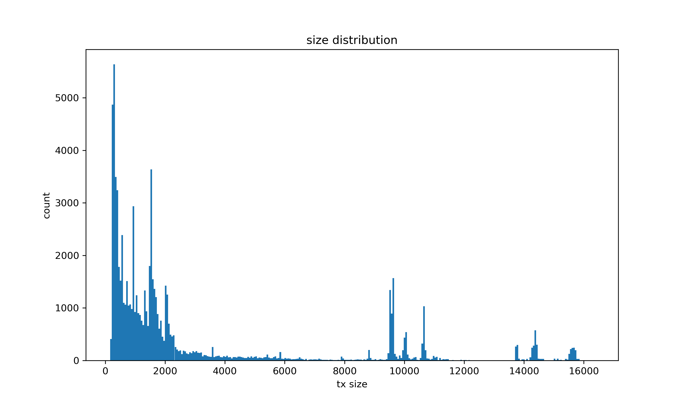
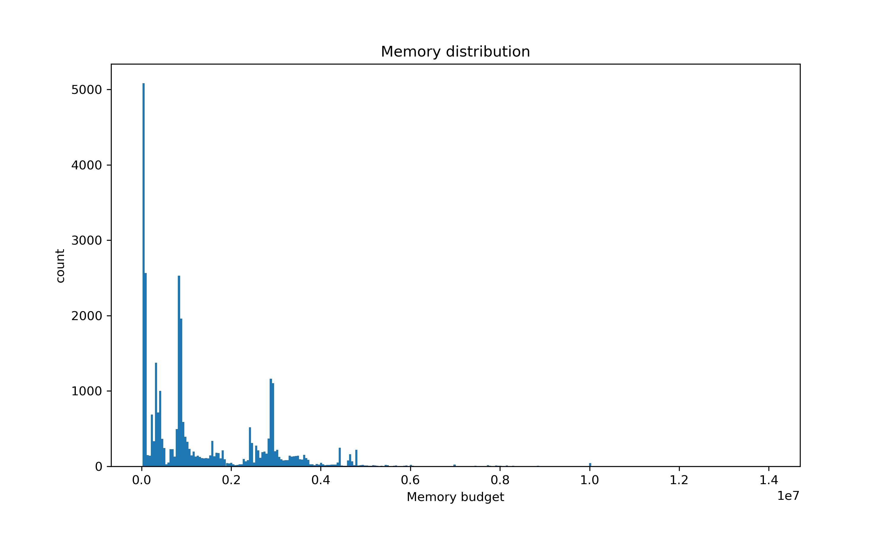
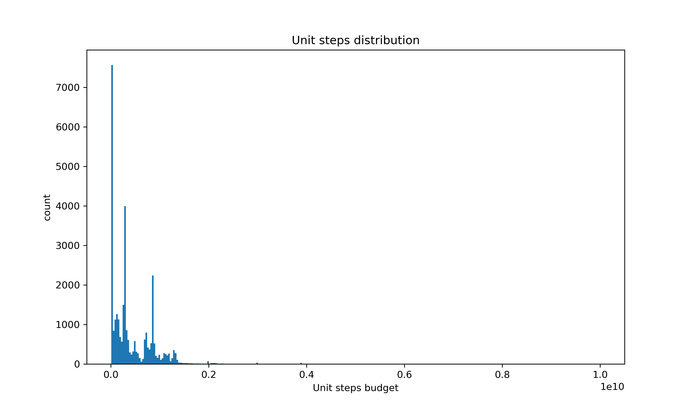

## Congestion periods from public resourses
Acording to https://cexplorer.io/usage we can consider peakes as congestion dates. 
For instance we can select 25.04.2022, 03.08.2022, 31.03.2023 

## Data sources for analytics.
We assume that during congestion periods, nodes have sufficient memory for transactions, and most transactions eventually make it into blocks, possibly with several hours of delay.


## Statistics for 31.03.2023 
Here are the statistics for 31.03.2023. 
We collect available parameters from mainnet in cardano-db:
```sql
SELECT
    tx.size,
    tx.fee,
    tx.script_size,
    redeemer.unit_mem, --The budget in Memory to run a script
    redeemer.unit_steps --The budget in Cpu steps to run a script
    
FROM block
LEFT JOIN tx ON block.id = tx.block_id  
LEFT JOIN redeemer ON tx.id = redeemer.tx_id
WHERE
  DATE(block.time) in ('2023-03-31')
```
Next we cat get distributions for tx size, limit memory and limit cpu steps. In order to simulate congestion we will try to sample spam transactions with parameters closed to these distributions.


.
|   Tx size |   Count |   Relative Frequency |   Cumulative Frequency |
|-----------------:|------------:|---------------------:|-----------------------:|
|                0 |           0 |          0           |                      0 |
|              100 |         345 |          0.00439726  |                    345 |
|              200 |       15844 |          0.201942    |                  16189 |
|              400 |        7487 |          0.0954269   |                  23676 |
|              600 |        4240 |          0.0540417   |                  27916 |
|              800 |        5693 |          0.0725611   |                  33609 |
|             1000 |       20404 |          0.260063    |                  54013 |
|             2000 |        6900 |          0.0879451   |                  60913 |
|             3000 |        2004 |          0.0255423   |                  62917 |
|             4000 |        1189 |          0.0151546   |                  64106 |
|             5000 |        1139 |          0.0145173   |                  65245 |
|             6000 |         543 |          0.0069209   |                  65788 |
|             7000 |         361 |          0.00460119  |                  66149 |
|             8000 |         525 |          0.00669148  |                  66674 |
|             9000 |        4774 |          0.0608478   |                  71448 |
|            10000 |        3013 |          0.0384027   |                  74461 |
|            11000 |         353 |          0.00449922  |                  74814 |
|            12000 |          78 |          0.000994162 |                  74892 |
|            13000 |         673 |          0.00857784  |                  75565 |
|            14000 |        1645 |          0.0209666   |                  77210 |
|            15000 |        1241 |          0.0158174   |                  78451 |
|            16000 |           7 |          8.92197e-05 |                  78458 |
|            17000 |           0 |          0           |                  78458 |

.
|  Max mem |   Count tx |   Relative Frequency |   Cumulative Frequency |
|-----------------:|------------:|---------------------:|-----------------------:|
|          0       |       47241 |          0.600664    |                  47241 |
|      10000       |        6543 |          0.0831935   |                  53784 |
|     100000       |        1381 |          0.0175593   |                  55165 |
|     200000       |        1038 |          0.013198    |                  56203 |
|     300000       |        2193 |          0.0278837   |                  58396 |
|     400000       |        1301 |          0.0165421   |                  59697 |
|     500000       |         241 |          0.00306429  |                  59938 |
|     600000       |         406 |          0.00516224  |                  60344 |
|     700000       |         311 |          0.00395433  |                  60655 |
|     800000       |        4852 |          0.0616926   |                  65507 |
|     900000       |        1038 |          0.013198    |                  66545 |
|          1e+06   |        3203 |          0.0407258   |                  69748 |
|          2e+06   |        5211 |          0.0662572   |                  74959 |
|          3e+06   |        2082 |          0.0264724   |                  77041 |
|          4e+06   |        1122 |          0.0142661   |                  78163 |
|          5e+06   |         174 |          0.00221239  |                  78337 |
|          6e+06   |          61 |          0.000775608 |                  78398 |
|          7e+06   |         116 |          0.00147493  |                  78514 |
|          8e+06   |          68 |          0.000864612 |                  78582 |
|          9e+06   |           9 |          0.000114434 |                  78591 |
|          1e+07   |          50 |          0.000635744 |                  78641 |
|          1.1e+07 |           4 |          5.08595e-05 |                  78645 |
|          1.2e+07 |           2 |          2.54298e-05 |                  78647 |
|          1.3e+07 |           1 |          1.27149e-05 |                  78648 |

.
|   Max Cpu steps |   Count tx |   Relative Frequency |   Cumulative Frequency |
|-----------------:|------------:|---------------------:|-----------------------:|
|            0     |       56668 |          0.720499    |                  56668 |
|            1e+08 |        2953 |          0.0375456   |                  59621 |
|            2e+08 |        6015 |          0.0764771   |                  65636 |
|            3e+08 |        1983 |          0.0252126   |                  67619 |
|            4e+08 |        1046 |          0.0132993   |                  68665 |
|            5e+08 |         851 |          0.01082     |                  69516 |
|            6e+08 |         762 |          0.00968837  |                  70278 |
|            7e+08 |        1555 |          0.0197709   |                  71833 |
|            8e+08 |        3329 |          0.0423262   |                  75162 |
|            9e+08 |         563 |          0.00715821  |                  75725 |
|            1e+09 |        2620 |          0.0333117   |                  78345 |
|            2e+09 |         228 |          0.00289888  |                  78573 |
|            3e+09 |          72 |          0.000915437 |                  78645 |
|            4e+09 |           3 |          3.81432e-05 |                  78648 |
|            5e+09 |           0 |          0           |                  78648 |
|            6e+09 |           0 |          0           |                  78648 |
|            7e+09 |           0 |          0           |                  78648 |
|            8e+09 |           0 |          0           |                  78648 |
|            9e+09 |           0 |          0           |                  78648 |
|            1e+10 |           3 |          3.81432e-05 |                  78651 |

