# Congested Testnet design 

## High level concept
- The congested testnet will simulate high loads by sampling spam transactions with characteristics similar to the historical congestion distribution, as detailed in the [statistics](./congestion-statistics.md)
- The testnet will be open to public access.
- A publicly available tADA faucet will be provided on the testnet for developers.
- The testnet will offer a mechanism to submit custom transactions.

## Architechture

